# 项目
###### 项目说明
这是一个使用javafx编写的redis客户端，支持基本的键操作，操作命令查看、键搜索、键过滤、导入导出、数据传输、服务监控、终端操作等功能，还支持暗色主题、系统主题跟随等能力

###### 依赖说明
1. base工程  
 https://gitee.com/oyzh1994/base
2. fx-base工程  
 https://gitee.com/oyzh1994/fx-base

###### 结构说明 
docker -> redis的docker启动配置文件等
package -> 打包相关配置
resource -> 项目相关资源文件
src -> 项目相关代码

# Maven打
###### 打包
mvn -X clean package -DskipTests

###### 注意
检查cmd里面java -version的版本号和项目版本号是否一致，否则可能出现无效的目标版本号21之类的问题

# 程序打包
###### windows x64
打包文件 在项目 -> package -> win_amd64_pack_config.json
cn.oyzh.easyredis.test.RedisPack.easyredis_win_amd64_pack

###### macos arm64
打包文件 在项目 -> package -> macos_arm64_pack_config.json
cn.oyzh.easyredis.test.RedisPack.easyredis_macos_arm64_pack

# docker启动实例
###### docker启动redis(单个)
docker run -itd -p 6379:6379 redis
docker run -itd -p 6379:6379 redis --requirepass 123456

###### docker启动redis(集群)
docker-compose -f .\redis-cluster-compose.yml up -d
docker-compose -f .\redis-example-compose.yml up -d
docker-compose -f .\redis-master-compose.yml up -d

# macos系统
###### mac无法启动解决方案1
sudo chmod +x EasyRedis.app

###### mac无法启动解决方案2
chmod -R 755 /路径/EasyRedis.app(可拖入命令行窗口)

###### mac无法启动解决方案3
当在macOS上运行.app文件时提示“已损坏，无法打开”，你可以尝试以下几种解决方法：
1. 允许“任何来源”下载的App运行‌
打开“系统偏好设置”->“安全性与隐私”->“通用”选项卡。
检查是否已经启用了“任何来源”选项。如果没有启用，先点击左下角的小黄锁图标解锁，然后选中“任何来源”‌1。
如果“任何来源”选项不可用，可以打开终端，输入命令sudo spctl --master-disable，然后按提示输入电脑的登录密码并回车，即可启用“任何来源”选项‌12。

# 程序相关截图
###### 截图1
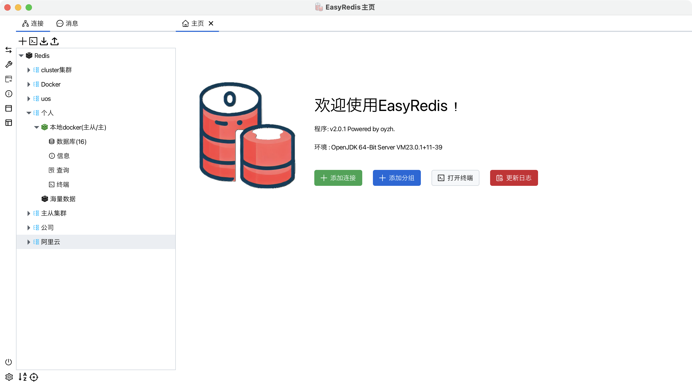
###### 截图2
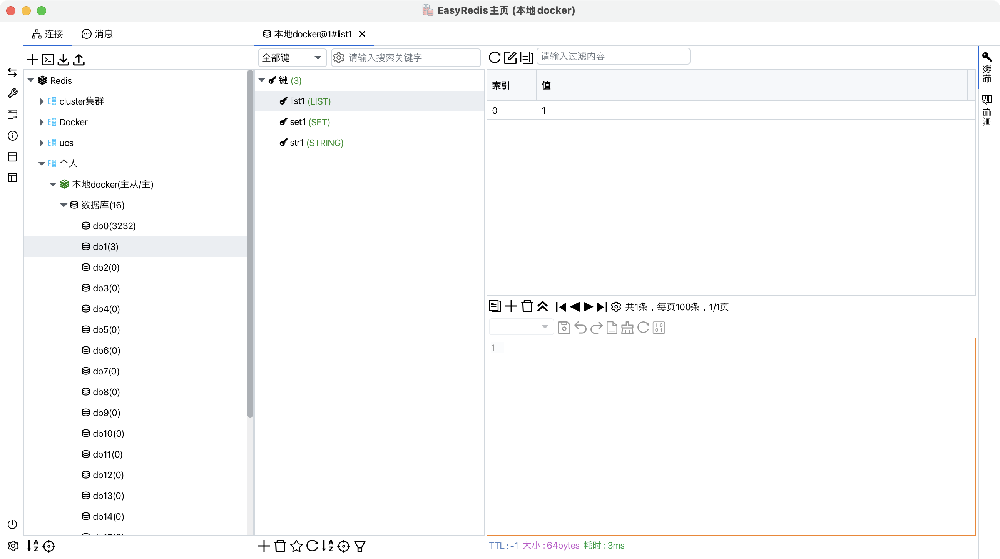
###### 截图3
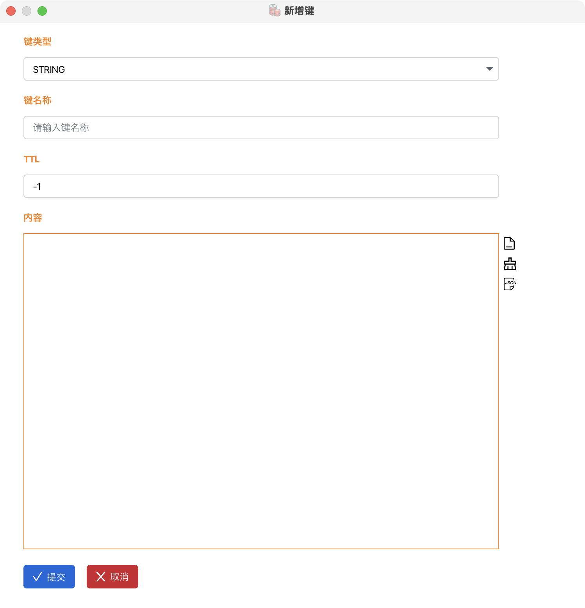
###### 截图4
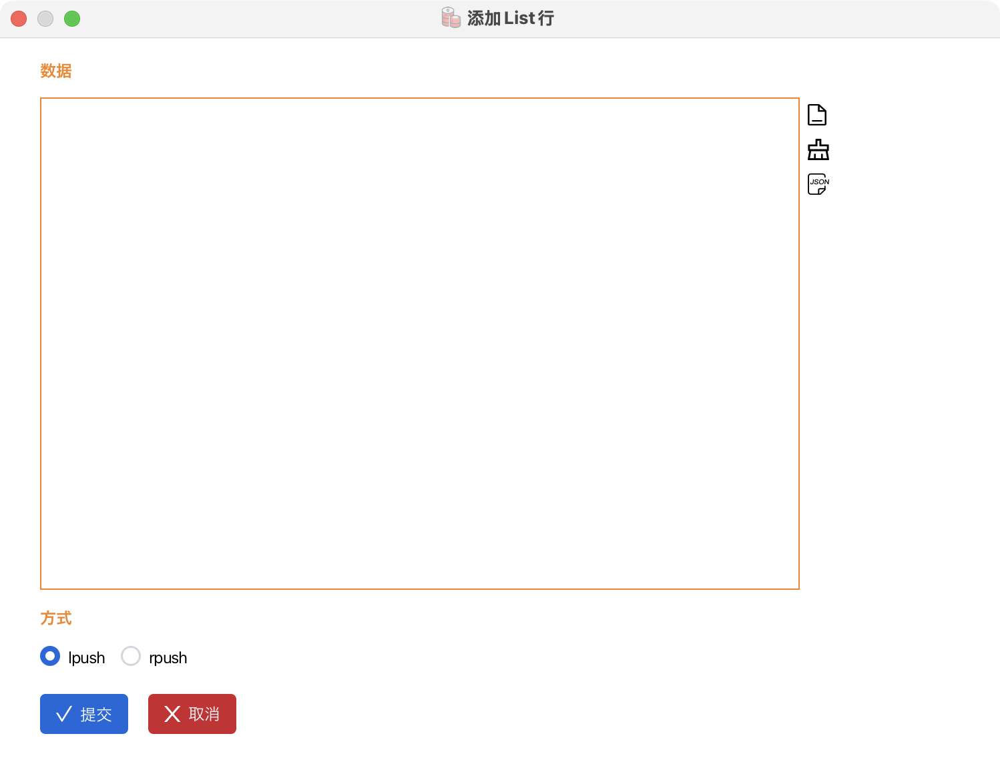
###### 截图5
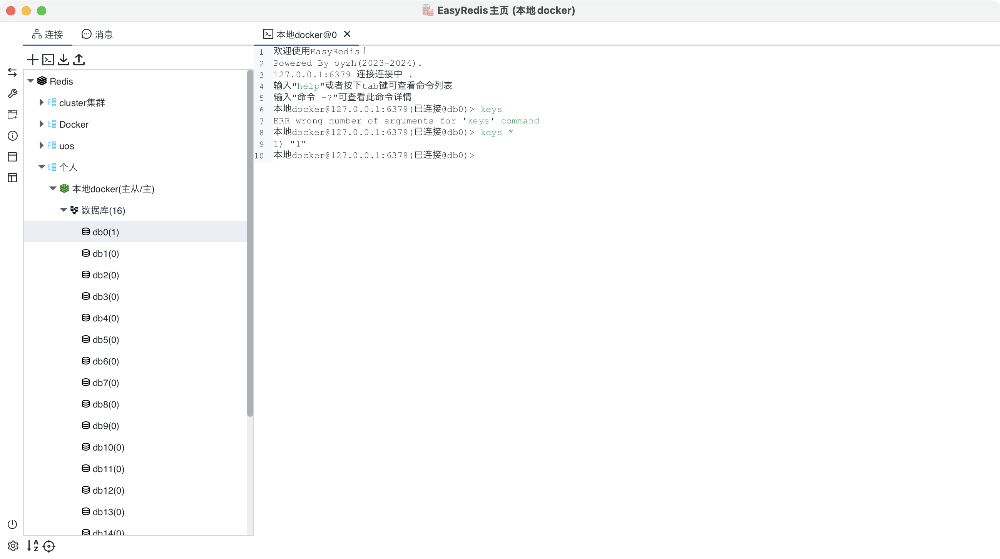
###### 截图6
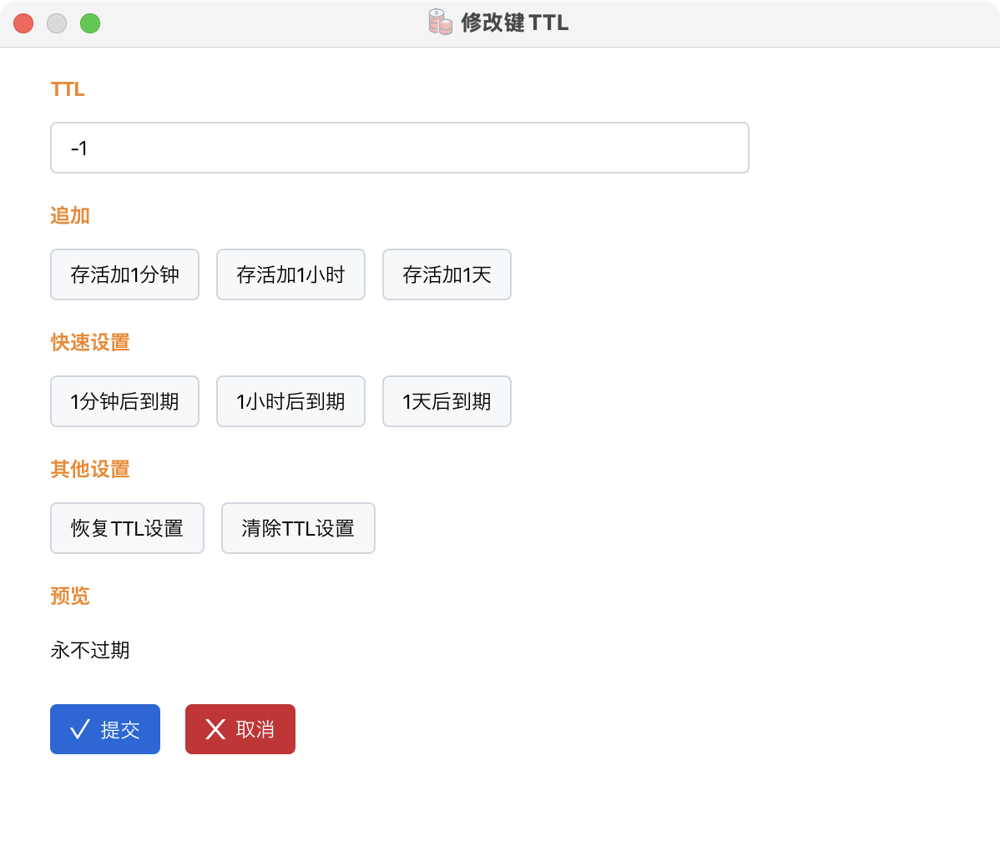
###### 截图7
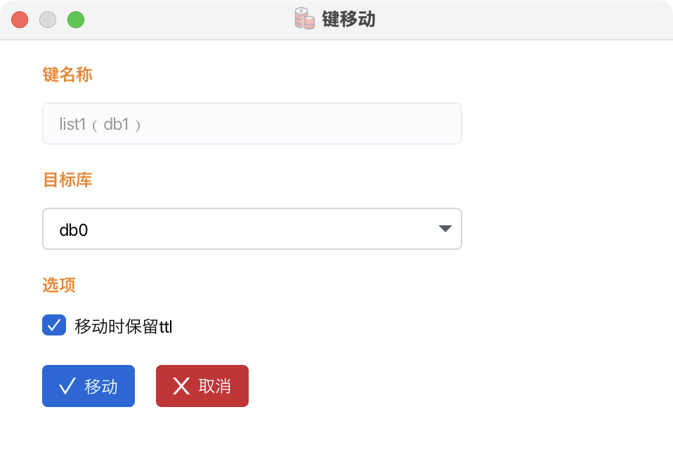
###### 截图8
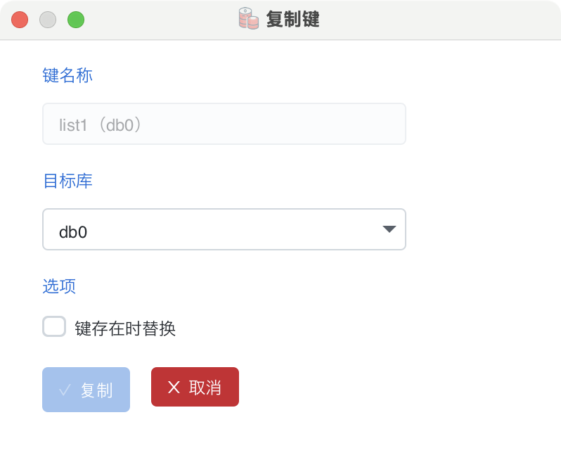
###### 截图9

###### 截图8
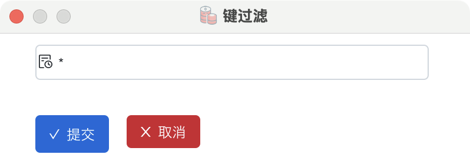
###### 截图11
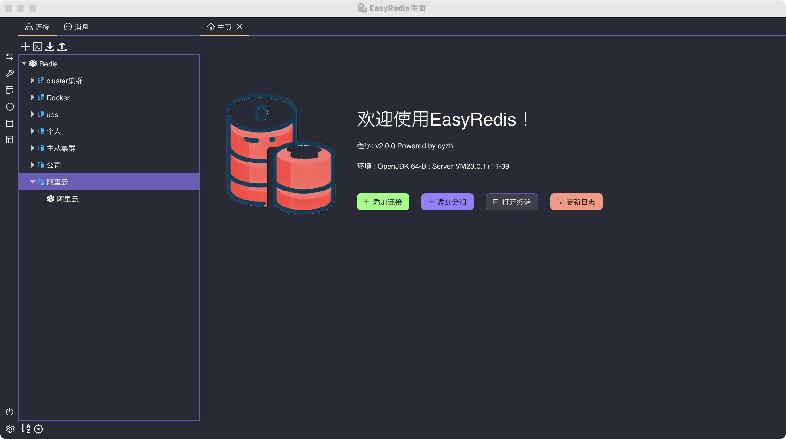
###### 截图12
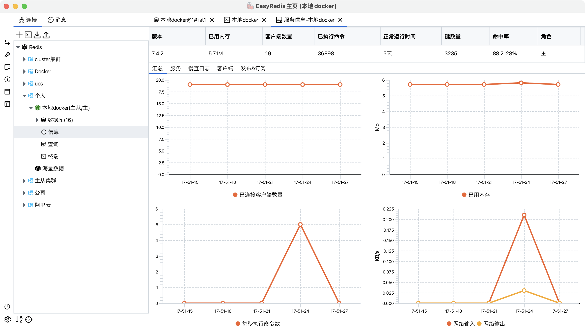
###### 截图13
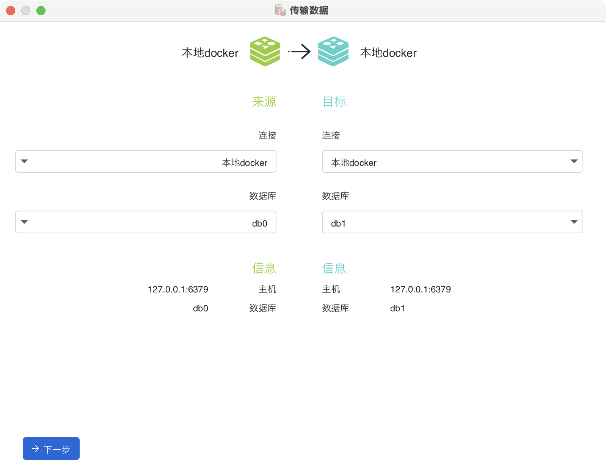
###### 截图14
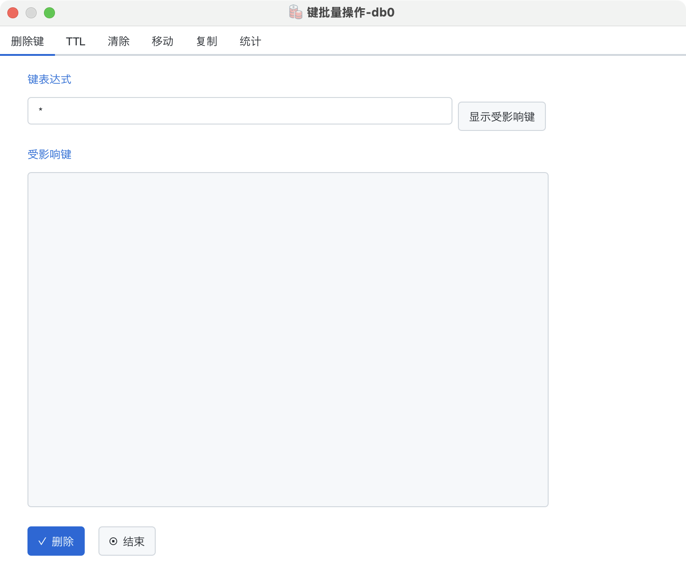